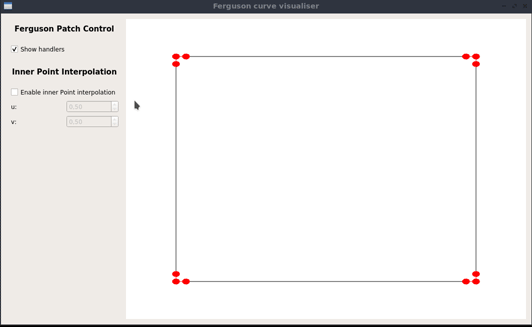

# Ferguson patch visualiser

  

Ferguson patch visualiser based on the traditional gradient mesh described in [(Barendrecht, 2008)](#1)  but considering only 
geometric information and fixed <i>twist vector</i> in (0,0). This app creates a Ferguson patch bounded by 4 Hermite curves which can be changed by moving its control
points (position and tangents). You can also hide or show these control points and interpolate a point within this curve 
parameterised by values of (u,v).

## Requirements
- C++ 17
- CMake 3.12.0
- OpenGL 3.3
- Qt 5.13.0

## Running
First you have to compile the source code. For example, you can create a directory to store the binaries, 
run cmake to generate the makefile and then compile this makefile as shown below:

    mkdir build
    cd build
    cmake ..
    make
  
In this example, an executable file will be generated at `build` directory. Thus, inside this directory, you can run this 
executable typing:

    ./ferguson
    
    
## References
<a id="1"> P. J. Barendrecht, M. Luinstra, J. Hogervorst, J. Kosinka (2018). </a>
<b>Locally refinable gradient meshes supporting branching and sharp colour transitions.</b> 
<i>The Visual Computer</i>, 34(6), 949-960.
